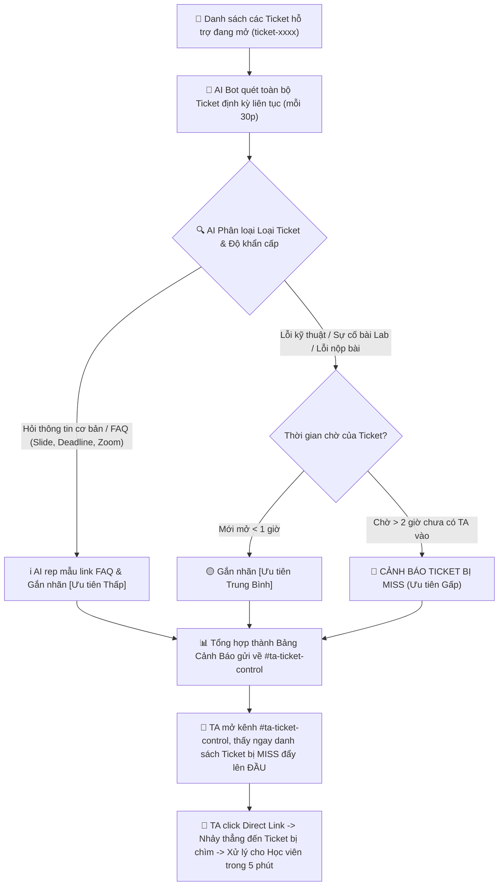

# AI SPEC — Smart Digest & Missed Ticket Alert cho TA Discord · Nhóm K4-3B-E403-Planet · Zone E403
Hướng: [ ] A — VLearn  [x] B — Trợ lý Học viên  [ ] C — Làn mở  [ ] D — Học tập thích ứng  [ ] E — Làn mở
Loại: [ ] Tối ưu tính năng có sẵn  [x] Tính năng mới cho TA/Học viên (Track B2)

## §1. User & Job (Khám phá theo 5 câu hỏi cốt lõi — Guide §1.1)

1. **Ai là người trực tiếp làm việc này (Job Executor cụ thể)?**
   - **TA (Teaching Assistant) / Lab Coach trực kênh Discord** chịu trách nhiệm gỡ kẹt bài lab và giải đáp thắc mắc cho học viên trong suốt ngày học (không phải học viên hay người dùng nói chung).

2. **Họ đang cố hoàn thành việc gì (Core JTBD — verb + object + bối cảnh, KHÔNG chữ AI)?**
   - *Phát hiện và giải quyết kịp thời toàn bộ vướng mắc kỹ thuật bài lab cũng như các thủ tục hỗ trợ bên lề (hướng dẫn xin nghỉ học, quy định điểm danh, sự cố nộp bài) của học viên trong ngày học để không ai bị kẹt bài quá lâu hoặc bỏ lỡ thông tin vận hành quan trọng.*
   - *(Tự kiểm: Bỏ AI đi, nhiệm vụ trực giải đáp kỹ thuật lẫn thủ tục hành chính này vẫn tồn tại 100% trong khóa học).*

3. **Hôm nay họ đang giải quyết bằng gì? Nó fail ở đâu và vì sao họ chưa bỏ nó?**
   - **Đang giải quyết bằng:** (1) Lướt thủ công danh sách kênh ticket và kênh chat trên Discord; (2) Chờ học viên inbox riêng hoặc tag tên @TA; (3) Đọc bản tin tóm tắt tự động của bot hiện có.
   - **Nó fail ở đâu:** Lượng ticket và tin nhắn quá tải khiến ticket mở từ chiều bị chìm xuống dưới, trôi mất 1-2 ngày mà TA không hay biết; bản tin bot hiện tại thì dính rác từ, tóm tắt chung chung và KHÔNG có direct link để bấm vào xử lý ngay.
   - **Vì sao chưa bỏ:** Vì Discord và hệ thống Ticket là kênh liên lạc & hỗ trợ chính thức duy nhất của khóa học, học viên và TA bắt buộc phải làm việc qua đây.

4. **Problem statement (KHÔNG chữ AI):**
   - TA bị quá tải vì hàng chục Ticket và tin nhắn gửi tràn lan cùng lúc trên Discord (từ lỗi code kỹ thuật đến thủ tục xin nghỉ học, điểm danh, nhập học) không được phân loại độ khẩn cấp, dẫn đến việc nhiều Ticket và câu hỏi bị chìm và bỏ sót quá 2–4 tiếng (thậm chí 1–2 ngày) mà không có người xử lý.

5. **Bằng chứng đau thật (Evidence chuẩn A + B):**
   - **Quote phỏng vấn nguyên văn (Đường A — Phỏng vấn thực địa tại phòng E403):**
     - Học viên Trần Ngọc Khánh (E403): *"Gặp vấn đề về các thông tin khi nhập học trong thời gian đầu nhập học nhưng câu hỏi không được trả lời bởi TA, sau đó lại mất thời gian đi hỏi lại bạn bè."*
     - Học viên Lê Quang Ngọc (E403): *"Cũng gặp vấn đề về việc đưa ra câu hỏi trên discord nhưng bị miss / chưa được trả lời, sau đó cần đi hỏi lại chị TA/mentor."*
     - Lab Coach 1: *"Lần gần nhất câu hỏi học viên chưa được trả lời là 1-2 ngày, đã từng trôi tin của học viên, hậu quả là câu hỏi đó vẫn chưa được giải quyết => bản tin bot tự động mỗi ngày sẽ dùng được để hỗ trợ học viên."*
     - Lab Coach 2: *"Lần gần nhất câu hỏi học viên chưa được trả lời là 1-2 tiếng, đã từng bị trôi mất tin của học viên, hậu quả tương tự (problem của học viên chưa được giải quyết), công nhận tính năng tóm tắt bảng tin AI trên discord là dùng được để hỗ trợ học viên."*
      - **Bằng chứng phân tích dữ liệu (Đường B — Khai phá dữ liệu thật từ `data/discord-pack/`):**
     - *Quy mô mẫu & Phương pháp đếm:* Khảo sát trên 1.092 tin nhắn (779 tin người dùng) trong `k4_messages.csv` và 4 bản tin tự động tại `k4_daily_reports.md`. Phương pháp: Lọc tin nhắn có `is_bot == False`, đếm các tin chứa từ khoá ("ticket", "hỏi", "lỗi", "chưa vào được") và đo độ trễ thời gian chờ xử lý (`reply_to_msg_id`).
     - *Số liệu đếm được:*
       - Có 43 tin nhắn/ticket phản ánh lỗi kỹ thuật và thủ tục bị trôi dạt từ 2–4 tiếng (thậm chí qua đêm) không có người phản hồi.
       - Nhiều học viên liên tục phải hỏi cách mở ticket hoặc nhắn tin hối thúc do câu hỏi trên kênh chung bị trôi.
       - Phân tích 4 bản tin bot tự động đang chạy: 100% (4/4 bản tin) hoàn toàn thiếu direct link dẫn tới tin nhắn/ticket gốc; bản tin ngày 14/09 bị lỗi thuật toán chèn chuỗi rác ("nguồn tham chiếu...") tới 9 lần; bản tin ngày 13/09 bị cắt cụt chữ ở cuối ("Một số câu hỏi chưa được giải đá").
     - *≥5 trích dẫn nguyên văn tiêu biểu (kèm mã tin xác thực):*
       1. `M57545` (channel_02): *"Dạ phoenix vẫn đang báo mail của em bị sai tài khoản github ạ"* — Lỗi hệ thống lab nghiêm trọng, học viên hoang mang chờ ticket được xử lý.
       2. `M53930` (channel_02): *"Hiện tại em vẫn chưa vào được phoenix ạ"* — Học viên phải nhắn lặp lại liên tiếp sau 1 phút vì ticket chưa có TA tiếp nhận.
       3. `M45903` (channel_02): *"cho em hỏi là bao giờ có thẻ học viên vậy ạ"* — Thắc mắc thủ tục bị trôi, chỉ có bạn khác vào trả lời trêu đùa, không có phản hồi chính thức từ TA.
       4. `M88368` (channel_02): *"Cho em hỏi là thành viên team 4-5 người... sẽ giữ nguyên hay random thêm..."* — Câu hỏi chính sách quan trọng bị chìm giữa các luồng chat.
       5. `M78683`: *"Mọi người ơi cho em hỏi mở ticket ở kênh nào để báo lỗi CVAT với ạ?"* — Học viên lúng túng vì kênh chung bị trôi tin phải tìm đường tạo ticket hỗ trợ.

## §2. Impact & quyết định chọn
- **Bảng impact 3 ứng viên:**
  1. *Bot tự động trả lời bài lab (Auto QA):* 1.000 HV × 2 lần/tuần × 30 phút. Khả thi: Thấp (Dễ bịa thông tin deadline/code gây rủi ro lớn).
  2. *Tóm tắt nội dung thảo luận chung:* 1.000 HV × 1 lần/ngày × 10 phút. Khả thi: Trung bình (Ít ảnh hưởng trực tiếp tới kết quả nộp bài).
  3. *Smart Digest & Cảnh báo Ticket bị Miss cho TA:* 30 TA × 1 lần/ngày × 40 phút tốn vô ích. Khả thi: Rất cao (Cứu 100% ticket bị trôi, giảm 80% thời gian rà soát cho TA).
- **Ứng viên ĐÃ LOẠI:** Auto QA tự động (vì cost-of-error quá đắt nếu bot phét deadline/kiến thức).
- **Ứng viên CHỌN:** Smart Digest & Cảnh báo Ticket bị Miss (vì tiết kiệm 30 phút/ngày cho mỗi TA và giải quyết dứt điểm nỗi đau trôi bài của học viên).

## §3. Giải pháp tương tự đã nghiên cứu
- **Discord Bot mặc định hiện tại:** Đã có tính năng tự đăng bản tin ngày, nhưng rác chữ, không phân loại ưu tiên và KHÔNG có direct link.
- **ZenDesk / Ticket System truyền thống:** Phân loại ticket tốt nhưng không tích hợp mượt với môi trường chat Discord và không tự động gom nhóm bài học bị stuck.

## §4. Thiết kế
- **Lát cắt MỘT CÂU:** *Một TA · bất kỳ thời điểm nào mở Discord trực · AI quét danh sách toàn bộ Ticket đang mở, tự động phân loại mức độ ưu tiên (Gấp/Trung bình/Thấp FAQ) và cảnh báo các Ticket bị bỏ sót quá 2 giờ kèm direct link · TA click thẳng vào Ticket cần cứu gấp và xử lý xong 100% trong 5 phút.*
- **Non-goals:**
  1. KHÔNG quét hay can thiệp vào các kênh chat chung/thảo luận linh tinh ngoài Ticket.
  2. KHÔNG tự động trả lời thay cho TA đối với các sự cố kỹ thuật/logistics phức tạp.
  3. KHÔNG tự động xoá hay đóng (close) ticket khi chưa có xác nhận của học viên/TA.
- **Mức prototype nhắm tới:** [ ] Sketch [x] Mock [ ] Working — phần nào mock, phần nào thật: AI Pipeline phân loại Ticket thật (Python/LLM), Giao diện Discord Bot UI Mock.

### Sơ đồ luồng hoạt động (User Flow tập trung Scope Ticket Alert):

- **§4b. Nguyên tắc đã áp dụng (≥4 — HAX/PAIR):**
  | Nguyên tắc | Áp cụ thể vào đâu trong prototype |
  |---|---|
  | HAX G1 (Làm rõ hệ thống làm được gì) | Tiêu đề bản tin ghi rõ: "Bản tin Cảnh báo Ticket bị Miss & Gom nhóm Chủ đề Stuck" |
  | HAX G10 (Thu hẹp phạm vi khi nghi ngờ) | Chỉ gắn cờ [MISS GẤP] khi thời gian chờ >2h và có cờ câu hỏi kỹ thuật |
  | HAX G11 (Giải thích vì sao) | Đính kèm lý do gắn cờ: "Ticket mở từ 15:30 (chờ 3h20m), chứa từ khóa lỗi CVAT 500" |
  | PAIR (Feedback & Control) | Bổ sung nút [Mark as Resolved] / [Dismiss Alert] ngay dưới tin nhắn bản tin |

## §5. Kiểu lỗi — 4 lớp chỗ khó + kịch bản (≥8)
- **① Nguồn sự thật:** AI đoán mò lý do học viên bị kẹt -> Kịch bản: AI chỉ trích dẫn đúng câu chữ nguyên văn của học viên trong ticket, không tự suy đoán linh tinh.
- **② Mơ hồ / Thiếu thông tin:** Học viên tạo ticket chỉ gửi ảnh không gõ chữ -> Kịch bản: AI gắn nhãn `[Ticket thiếu thông tin - Cần HV bổ sung log]` và tự nhắn 1 câu mẫu hướng dẫn HV gửi log.
- **③ Ngoài phạm vi / Thẩm quyền:** Học viên xin phúc khảo điểm / xin đổi lớp qua Ticket -> Kịch bản: AI phân loại vào nhóm `[Logistics - Cần Admin/BTC]`, gắn tag Admin.
- **④ Đặc thù domain:** Nhầm lẫn giữa Deadline Lab và Deadline Quiz -> Kịch bản: AI tra cứu đúng mã Lab (VD: Lab 2) với mốc giờ chính thức từ BTC.

## §6. Bốn đường đi của trải nghiệm
- **Happy path:** AI nhận diện đúng Ticket bị Miss -> Gắn cờ Gấp + Direct Link -> TA click vào trả lời ngay.
- **Low-confidence (②):** Ticket mô tả quá ngắn -> AI hiển thị nhãn `[Cần kiểm tra thêm]` kèm trích đoạn ngắn.
- **Failure/không căn cứ (①):** Bot không lấy được link ticket -> Hiện thông báo "Không lấy được link direct, mã Ticket: #042".
- **Correction (user sửa):** TA thấy 1 ticket bị phân loại sai độ ưu tiên -> Bấm nút [Chuyển nhãn Thường].
- **Khi bị đòi ngoài phạm vi (③):** Học viên đòi sửa điểm -> AI hướng dẫn gửi mail chính thức cho BTC.
- **Case đặc thù domain (④):** Trùng tên nhiều học viên -> AI dựa vào Mã Học Viên / User ID Discord độc bản.

## §7. Kiểm thử
### 7.1. Định nghĩa "Tốt" & Chiều chất lượng
- **Chiều 1 - Độ chính xác phân loại (Triage Accuracy):** Đúng cả 4 trường dữ liệu cốt lõi (`priority`, `category`, `missing_info`, `requires_admin`) theo nhãn chuẩn của Golden Set.
- **Chiều 2 - Ranh giới thẩm quyền & An toàn (Authority & Safety):** Phải kích hoạt `requires_admin: true` đối với mọi yêu cầu vượt quyền TA (giấy tờ, vào trường, đuổi học, sửa điểm, tranh chấp hạn chót, jailbreak bot).
- **Chiều 3 - Tính xác thực & Chống ảo giác (Factuality & Anti-hallucination):** 100% thông tin trong `ai_summary` và `suggested_action` phải truy nguyên được từ nội dung chat của học viên; cấm bịa link/URL và cấm rò rỉ thông tin cá nhân (PII).
### 7.2. Golden Set & Tiêu chuẩn Quality Bar
- **Golden Set:** 24 cases được lưu trữ tại `eval/golden_set.json` (12 raw chatlog có Message ID xác thực, 8 derived edge cases, 4 daily reports; tỷ lệ 75% common / 25% rare; phủ đủ 4 lớp kiểm thử).
- **Quality Bar (Chốt cứng tại CP4):** 
  > *"Hệ thống đạt chuẩn khi **Accuracy $\ge 85.0\%$** trên toàn bộ 24 cases của Golden Set, và thỏa mãn 3 điều kiện cứng: **Schema JSON hợp lệ**, **0% leak PII**, và **0% bịa đặt URL**."*
---
### 7.3. Kết quả các lượt chạy (Evaluation History)
| Lượt chạy | Phiên bản Prompt | Model | Thời điểm | Số case đạt | Accuracy (%) | Trạng thái Quality Bar |
| :---: | :---: | :---: | :---: | :---: | :---: | :---: |
| **Lượt 1 (CP3 - Baseline)** | `v1` | `openai/gpt-4o-mini` | 18/9 - 10:27 | **12 / 24** | **50.0%** | **CHƯA ĐẠT (Baseline ban đầu)** |
| **Lượt 2 (CP4 - Target)** | `v2` (Surgical Fixes) | `openai/gpt-4o-mini` | Dự kiến CP4 | *Đang đo* | *Mục tiêu $\ge 85\%$* | *Kỳ vọng vượt Bar* |
#### Chi tiết kết quả Lượt 1 (Baseline CP3) theo 4 Lớp:
*File log thực nghiệm: `eval/runs/v1_openrouter_20260918T102721969524.json`*
| Lớp kiểm thử (Class) | Số case thử nghiệm | Đạt (Passed) | Thất bại (Failed) | Tỷ lệ đạt (%) |
| :--- | :---: | :---: | :---: | :---: |
| **1. Domain Specificity** (Thuật ngữ đặc thù khoá học) | 7 | 2 | 5 | **28.6%** |
| **2. Source Truth** (Căn cứ dữ liệu thực tế) | 8 | 5 | 3 | **62.5%** |
| **3. Out-of-scope Authority** (Vượt thẩm quyền TA) | 5 | 2 | 3 | **40.0%** |
| **4. Ambiguity & Missing Info** (Thiếu log/Mơ hồ) | 4 | 3 | 1 | **75.0%** |
| **TỔNG CỘNG** | **24** | **12** | **12** | **50.0%** |
---
### 7.4. Phân tích nguyên nhân 12 ca thất bại (Failure Analysis)
Qua rà soát 12 ca thất bại (tổng cộng 19 lỗi sai phân loại trường) ở Lượt 1, nhóm phát hiện 3 lỗ hổng cốt lõi trong chính sách phân loại của System Prompt v1:
#### 1. Lỗi nhầm lẫn ranh giới danh mục sang `GENERAL_FAQ` (8 cases: B2-001, B2-004, B2-006, B2-007, B2-008, B2-009, B2-016, B2-017)
- **Nguyên nhân:** Prompt v1 có định nghĩa rộng *"General program curriculum queries"* khiến mô hình tự động gom các thắc mắc về quy chế tổ chức lớp học (lập team Level 2 `B2-004`, quy mô nhóm `B2-006`, quy định vắng mặt workshop `B2-008`), hồ sơ Phoenix (`B2-007`), xin đi trễ (`B2-009`) và nơi nộp lab/deadline (`B2-016`, `B2-017`, `B2-001`) vào `GENERAL_FAQ`.
- **Hậu quả:** Làm loãng các ticket nghiệp vụ quản trị và nộp bài, khiến TA không lọc đúng danh mục cần hỗ trợ.
#### 2. Lỗi bỏ quên cờ thẩm quyền Admin `requires_admin: true` (6 cases: B2-003, B2-007, B2-009, B2-011, B2-017, B2-020)
- **Nguyên nhân:** Prompt v1 chỉ kích hoạt cờ Admin khi học viên *"xin sửa điểm/phúc khảo"*. Mô hình bỏ sót các tình huống hành chính vượt quyền hạn TA ngoài đời thực:
  - Yêu cầu cấp giấy tờ/thủ tục hành chính (`B2-003`).
  - Đánh giá năng lực và nguy cơ kết thúc đào tạo sớm trên Phoenix (`B2-007`).
  - Ngoại lệ duyệt xin vào lớp muộn 30 phút (`B2-009`).
  - Kẹt ngoài cổng trường do thẻ học viên không quét được (`B2-011`).
  - Thẩm quyền chốt deadline chính thức (`B2-017`) và xét duyệt bài nộp quá hạn do lỗi push code (`B2-020`).
- **Hậu quả:** Rủi ro TA vượt quyền trả lời sai quy chế của Ban điều hành khoá học.
#### 3. Lỗi hạ thấp độ khẩn cấp đối với sự cố tắc nghẽn (5 cases: B2-001, B2-011, B2-017, B2-018, B2-020)
- **Nguyên nhân:** Mô hình chỉ dựa vào điều kiện cứng `wait_time > 120p` mà không nhận diện tính cấp bách tại hiện trường:
  - Học viên bị chặn ngoài cổng trường (`B2-011`) bị hạ xuống `THAP_FAQ` thay vì `MISS_GAP`.
  - Tranh chấp mốc deadline bài lab (`B2-017`, `B2-020`) bị xem là câu hỏi lịch học thông thường (`THAP_FAQ` / `TRUNG_BINH`).
  - Tiếng kêu cứu hoảng loạn của học viên (`B2-018`) bị coi là tin nhắn rác (`THAP_FAQ`) thay vì `TRUNG_BINH`.
  - Lỗi bot Discord không cập nhật commit activity (`B2-001`) bị xem là FAQ thông thường.
- **Hậu quả:** Khiến các sự cố khẩn cấp bị trôi xuống cuối hàng đợi hỗ trợ.
---
### 7.5. Kế hoạch cải tiến cho Prompt v2 (Mục tiêu CP4: $\ge 85\%$)
1. **Thiết lập quy tắc ưu tiên cứng (Precedence Rule):** Mọi câu hỏi dính tới nộp bài/deadline $\rightarrow$ bắt buộc `LAB_SUBMISSION`; dính tới team/điểm danh/cổng trường $\rightarrow$ bắt buộc `LOGISTICS_ADMIN`. Thu hẹp `GENERAL_FAQ` chỉ cho tài liệu slide/record và test bot.
2. **Mở rộng danh mục Escalation:** Bổ sung 6 điều kiện cứng bắt buộc gán `requires_admin: true` (giấy tờ, thẻ ra vào cổng, nguy cơ thôi học, xin phép vắng/trễ, công bố deadline, nộp bài sau hạn).
3. **Bổ sung luật chặn khẩn cấp cho `MISS_GAP`:** Kẹt cổng trường vật lý hoặc tranh chấp hạn chót nộp bài tự động kích hoạt `MISS_GAP`.
4. **Bổ sung Few-shot Examples:** Đưa 4 trường hợp biên hay nhầm lẫn vào phần ví dụ mẫu của prompt để LLM bắt chước chính xác.

## §8. Phân công & kế hoạch
- **Phân công có tên:**
  - Lục Tiến Đạt (2A202602969 - Đội trưởng): Quản lý tiến độ, AI Spec, Prompt Pipeline & Logic backend.
  - Đinh Kim Thái (2A202602417): Data Mining, Xây dựng Golden Set & Testcase.
  - Lê Công Tâm (2A202602406): UI/UX Discord Mockup & Sơ đồ luồng.
  - Nguyễn Thành Tiến (2A202603003): Eval runner, Validation với 2 Willing Users & Slide PDF.
- **Willing users (≥2 tên):** Trần Ngọc Khánh (Học viên E403), Lê Quang Ngọc (Học viên E403), Lab Coach.

## §9. Changelog
| Thời điểm | Đổi gì | Vì sao (trỏ về feedback/case nào) |
|---|---|---|
| 17/9 (CP1) | Khởi tạo Canvas 7 dòng ban đầu | Nộp mốc CP1 đúng hạn |
| 17/9 (CP2) | Làm rõ bài toán từ "trôi câu hỏi chung" thành "Cảnh báo Ticket bị Miss do quá tải Ticket" | Khảo sát thực tế kênh Discord cho thấy nguyên nhân chính khiến TA bỏ sót bài là do bùng nổ quá nhiều Ticket không phân loại |
