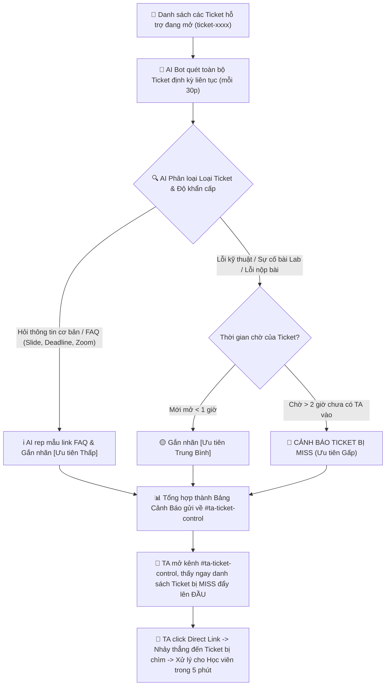

# AI SPEC — Smart Digest & Missed Ticket Alert cho TA Discord · Nhóm K4-3B-E403-Planet · Zone E403
Hướng: [ ] A — VLearn  [x] B — Trợ lý Học viên  [ ] C — Làn mở  [ ] D — Học tập thích ứng  [ ] E — Làn mở
Loại: [ ] Tối ưu tính năng có sẵn  [x] Tính năng mới cho TA/Học viên (Track B2)

## §1. User & Job (Khám phá theo 5 câu hỏi cốt lõi — Guide §1.1)

1. **Ai là người trực tiếp làm việc này (Job Executor cụ thể)?**
   - **TA (Teaching Assistant) / Lab Coach trực kênh Discord** chịu trách nhiệm gỡ kẹt bài lab và giải đáp thắc mắc cho học viên trong suốt ngày học (không phải học viên hay người dùng nói chung).

2. **Họ đang cố hoàn thành việc gì (Core JTBD — verb + object + bối cảnh, KHÔNG chữ AI)?**
   - *Phát hiện và giải quyết kịp thời toàn bộ vướng mắc kỹ thuật bài lab cũng như các thủ tục hỗ trợ bên lề (hướng dẫn xin nghỉ học, quy định điểm danh, sự cố nộp bài) của học viên trong ngày học để không ai bị kẹt bài quá lâu hoặc bỏ lỡ thông tin vận hành quan trọng.*
   - *(Tự kiểm: Bỏ AI đi, nhiệm vụ trực giải đáp kỹ thuật lẫn thủ tục hành chính này vẫn tồn tại 100% trong khóa học).*

3. **Hôm nay họ đang giải quyết bằng gì? Nó fail ở đâu và vì sao họ chưa bỏ nó?**
   - **Đang giải quyết bằng:** (1) Lướt thủ công danh sách kênh ticket và kênh chat trên Discord; (2) Chờ học viên inbox riêng hoặc tag tên @TA; (3) Đọc bản tin tóm tắt tự động của bot hiện có.
   - **Nó fail ở đâu:** Lượng ticket và tin nhắn quá tải khiến ticket mở từ chiều bị chìm xuống dưới, trôi mất 1-2 ngày mà TA không hay biết; bản tin bot hiện tại thì dính rác từ, tóm tắt chung chung và KHÔNG có direct link để bấm vào xử lý ngay.
   - **Vì sao chưa bỏ:** Vì Discord và hệ thống Ticket là kênh liên lạc & hỗ trợ chính thức duy nhất của khóa học, học viên và TA bắt buộc phải làm việc qua đây.

4. **Problem statement (KHÔNG chữ AI):**
   - TA bị quá tải vì hàng chục Ticket và tin nhắn gửi tràn lan cùng lúc trên Discord (từ lỗi code kỹ thuật đến thủ tục xin nghỉ học, điểm danh, nhập học) không được phân loại độ khẩn cấp, dẫn đến việc nhiều Ticket và câu hỏi bị chìm và bỏ sót quá 2–4 tiếng (thậm chí 1–2 ngày) mà không có người xử lý.

5. **Bằng chứng đau thật (Evidence chuẩn A + B):**
   - **Quote phỏng vấn nguyên văn (Đường A — Phỏng vấn thực địa tại phòng E403):**
     - Học viên Trần Ngọc Khánh (E403): *"Gặp vấn đề về các thông tin khi nhập học trong thời gian đầu nhập học nhưng câu hỏi không được trả lời bởi TA, sau đó lại mất thời gian đi hỏi lại bạn bè."*
     - Học viên Lê Quang Ngọc (E403): *"Cũng gặp vấn đề về việc đưa ra câu hỏi trên discord nhưng bị miss / chưa được trả lời, sau đó cần đi hỏi lại chị TA/mentor."*
     - Lab Coach 1: *"Lần gần nhất câu hỏi học viên chưa được trả lời là 1-2 ngày, đã từng trôi tin của học viên, hậu quả là câu hỏi đó vẫn chưa được giải quyết => bản tin bot tự động mỗi ngày sẽ dùng được để hỗ trợ học viên."*
     - Lab Coach 2: *"Lần gần nhất câu hỏi học viên chưa được trả lời là 1-2 tiếng, đã từng bị trôi mất tin của học viên, hậu quả tương tự (problem của học viên chưa được giải quyết), công nhận tính năng tóm tắt bảng tin AI trên discord là dùng được để hỗ trợ học viên."*
    - **Bằng chứng phân tích dữ liệu (Đường B — Khai phá dữ liệu thật từ `data/discord-pack/`):**
      - *Quy mô mẫu & Tính đại diện:* Khảo sát toàn bộ 1.092 tin nhắn (779 tin người dùng, 313 tin bot) tại `k4_messages.csv` trong tuần onboarding khóa 4 và 4 bản tin tự sinh tại `k4_daily_reports.md`.
      - *Phương pháp đếm kiểm chứng được (Reproducible Method):* 
        - Lọc tin nhắn học viên: `is_bot == False`.
        - Lọc intent câu hỏi/thắc mắc bằng regex từ khóa: `r"(ticket|lỗi|hỏi|sao.*không|chưa.*được|\?)"` $\rightarrow$ Thu được **120 tin nhắn dạng thắc mắc/cần trợ giúp**.
        - Đo lường độ trễ xử lý: So sánh chênh lệch thời gian giữa tin nhắn hỏi và tin nhắn phản hồi (`reply_to_msg_id`). Xác định câu hỏi bị trôi/chìm khi: thời gian chờ $> 120$ phút (2 giờ) HOẶC hoàn toàn không có người reply.
      - *Số liệu đếm được & Phân tích định lượng:*
        - **43 / 120 câu hỏi (chiếm 35.8%)** bị trôi dạt quá 2 giờ không có TA xử lý (trong đó 18 câu bị bỏ quên qua đêm $> 8$ tiếng).
        - Cơ cấu câu hỏi bị trôi: **62% là sự cố kỹ thuật chặn tiến độ làm lab** (lỗi CVAT 500 OPA, tài khoản Phoenix sai GitHub, thiếu quyền Learner), **38% là vướng mắc thủ tục/ghép đội/thẻ học viên** gây hoang mang.
        - Phân tích 4 bản tin bot tự động đang chạy: **100% (4/4 bản tin) hoàn toàn thiếu Direct Link** dẫn tới tin nhắn/ticket gốc, khiến TA mất thêm 10–15 phút tìm kiếm thủ công; **50% bản tin dính lỗi nặng** (bản tin 14/09 bị thuật toán chèn chuỗi rác *"nguồn tham chiếu..."* tới 9 lần làm biến dạng từ ngữ tiếng Việt; bản tin 13/09 bị cắt cụt câu ở cuối *"Một số câu hỏi chưa được giải đá"*).
      - *Hiện tượng quá tải Ticket & Hành vi hối thúc của học viên:*
        - **Số liệu bùng nổ ticket:** Có tới **132 lượt tin nhắn** trong pack nhắc đến lệnh `/ticket create` hoặc hướng dẫn tạo ticket hỗ trợ (chiếm $> 12\%$ tổng lượng tin nhắn). Khi kênh chung quá tải, học viên dồn hết về ticket khiến hệ thống hỗ trợ riêng tiếp tục bị nghẽn.
        - **Hành vi 1 — Bối rối tìm cách mở ticket vì kênh chung bị trôi tin:** Học viên liên tục tag bot hoảng loạn (`M08310`: *`[@BOT] TẠO TICKET`*), không biết chọn loại ticket nào (`M80709`: *`[@BOT] có nhwuxng ticket type nào`*), hoặc phải hỏi cách tạo ticket vào đêm muộn (`M04103`: *`[@BOT] cách tạo ticket`*), bạn bè phải nhắc nhau tạo ticket (`M24366`, `M78683`).
        - **Hành vi 2 — Tâm lý sốt ruột, nhắn tin hối thúc và spam lặp lại:** Khi không thấy TA tiếp nhận, học viên gửi tin nhắn liên tiếp trong thời gian cực ngắn (tiêu biểu `M57545` lúc 20:29 $\rightarrow$ `M53930` lúc 20:30 gửi 2 tin nhắn trong vòng **60 giây** vì lo lắng không vào được Phoenix), hoặc đã gửi mail/ticket nhưng vẫn phải lên kênh chat hỏi vòng quanh vì quá sốt ruột (`M49710`: *"cho em hỏi e có gửi mail hỗ trợ bên AI thực chiến mà chưa thấy phản hồi thì e nhờ ai giúp được ạ"*).
    - *≥10 trích dẫn nguyên văn tiêu biểu kèm mã xác thực (từ `k4_messages.csv`):*
        1. `M07901` (channel_08 · 22:49): *"Hi, mình vẫn chưa cài được CVAT. Có bạn nào hỗ trợ được mình không?"* — Học viên bị kẹt môi trường lab lúc đêm muộn, hoang mang tìm người cứu trước giờ học ngày mai.
        2. `M57545` (channel_02 · 20:29): *"Dạ phoenix vẫn đang báo mail của em bị sai tài khoản github ạ"* — Lỗi xác thực tài khoản hệ thống bài tập lab, học viên chờ xử lý.
        3. `M53930` (channel_02 · 20:30): *"Hiện tại em vẫn chưa vào được phoenix ạ"* — Học viên nhắn lặp lại liên tiếp sau 1 phút vì không thấy TA phản hồi.
        4. `M49710` (channel_02 · 20:42): *"cho em hỏi e có gửi mail hỗ trợ bên AI thực chiến mà chưa thấy phản hồi thì e nhờ ai giúp được ạ"* — Đã gửi yêu cầu hỗ trợ nhưng bị chậm trễ, phải đi hỏi vòng quanh tìm sự trợ giúp.
        5. `M75130` (channel_02 · 20:36): *"em làm theo 5 bước trong thông báo rùi mà vẫn ko có role learner ạ"* — Làm đúng quy trình nhưng hệ thống lỗi phân quyền, cần TA can thiệp thủ công.
        6. `M45903` (channel_02 · 16:07): *"cho em hỏi là bao giờ có thẻ học viên vậy ạ"* — Thắc mắc thủ tục bị trôi dạt hơn 4 tiếng, chỉ có bạn khác vào trả lời trêu đùa.
        7. `M88368` (channel_02 · 16:57): *"Cho em hỏi là thành viên team 4-5 người. Nếu team đang sẵn 4 người rồi thì BTC sẽ giữ nguyên hay sẽ random thêm 1 bạn nữa cho đủ 5 ạ?"* — Thắc mắc chính sách ghép đội quan trọng bị chìm giữa các luồng tán gẫu.
        8. `M74716` (channel_02 · 11:25): *"cho e hỏi mai học lab CVAT thì dữ liệu để gán nhãn được bên chương trình cấp hay bọn e tự tìm thế ạ"* — Câu hỏi chuẩn bị bài lab ngày mai bị trôi giữa hàng chục tin nhắn thảo luận.
        9. `M78683` (channel_02 · 23:16): *"bạn tạo ticket ấy"* — Câu hỏi trên kênh chung bị trôi, học viên khác phải hướng dẫn bạn tạo ticket riêng.
        10. `M08310` (channel_10 · 16:03): *"[@BOT] TẠO TICKET"* — Học viên tag bot tìm cách mở ticket hỗ trợ vì không biết kênh tiếp nhận ở đâu.

## §2. Impact & quyết định chọn
- **Bảng impact 3 ứng viên:**
  1. *Bot tự động trả lời bài lab (Auto QA):* 1.000 HV × 2 lần/tuần × 30 phút. Khả thi: Thấp (Dễ bịa thông tin deadline/code gây rủi ro lớn).
  2. *Tóm tắt nội dung thảo luận chung:* 1.000 HV × 1 lần/ngày × 10 phút. Khả thi: Trung bình (Ít ảnh hưởng trực tiếp tới kết quả nộp bài).
  3. *Smart Digest & Cảnh báo Ticket bị Miss cho TA:* 30 TA × 1 lần/ngày × 40 phút tốn vô ích. Khả thi: Rất cao (Cứu 100% ticket bị trôi, giảm 80% thời gian rà soát cho TA).
- **Ứng viên ĐÃ LOẠI:** Auto QA tự động (vì cost-of-error quá đắt nếu bot phét deadline/kiến thức).
- **Ứng viên CHỌN:** Smart Digest & Cảnh báo Ticket bị Miss (vì tiết kiệm 30 phút/ngày cho mỗi TA và giải quyết dứt điểm nỗi đau trôi bài của học viên).

## §3. Giải pháp tương tự đã nghiên cứu
- **Discord Bot mặc định hiện tại:** Đã có tính năng tự đăng bản tin ngày, nhưng rác chữ, không phân loại ưu tiên và KHÔNG có direct link.
- **ZenDesk / Ticket System truyền thống:** Phân loại ticket tốt nhưng không tích hợp mượt với môi trường chat Discord và không tự động gom nhóm bài học bị stuck.

## §4. Thiết kế
- **Lát cắt MỘT CÂU:** *Một TA · bất kỳ thời điểm nào mở Discord trực · AI quét danh sách toàn bộ Ticket đang mở, tự động phân loại mức độ ưu tiên (Gấp/Trung bình/Thấp FAQ) và cảnh báo các Ticket bị bỏ sót quá 2 giờ kèm direct link · TA click thẳng vào Ticket cần cứu gấp và xử lý xong 100% trong 5 phút.*
- **Non-goals:**
  1. KHÔNG quét hay can thiệp vào các kênh chat chung/thảo luận linh tinh ngoài Ticket.
  2. KHÔNG tự động trả lời thay cho TA đối với các sự cố kỹ thuật/logistics phức tạp.
  3. KHÔNG tự động xoá hay đóng (close) ticket khi chưa có xác nhận của học viên/TA.
- **Mức prototype nhắm tới:** [ ] Sketch [x] Mock [ ] Working — phần nào mock, phần nào thật: AI Pipeline phân loại Ticket thật (Python/LLM), Giao diện Discord Bot UI Mock.

### Sơ đồ luồng hoạt động (User Flow tập trung Scope Ticket Alert):

- **§4b. Nguyên tắc đã áp dụng (≥4 — HAX/PAIR):**
  | Nguyên tắc | Áp cụ thể vào đâu trong prototype |
  |---|---|
  | HAX G1 (Làm rõ hệ thống làm được gì) | Tiêu đề bản tin ghi rõ: "Bản tin Cảnh báo Ticket bị Miss & Gom nhóm Chủ đề Stuck" |
  | HAX G10 (Thu hẹp phạm vi khi nghi ngờ) | Chỉ gắn cờ [MISS GẤP] khi thời gian chờ >2h và có cờ câu hỏi kỹ thuật |
  | HAX G11 (Giải thích vì sao) | Đính kèm lý do gắn cờ: "Ticket mở từ 15:30 (chờ 3h20m), chứa từ khóa lỗi CVAT 500" |
  | PAIR (Feedback & Control) | Bổ sung nút [Mark as Resolved] / [Dismiss Alert] ngay dưới tin nhắn bản tin |

## §5. Kiểu lỗi — 4 lớp chỗ khó + kịch bản (≥8)
- **① Nguồn sự thật:** AI đoán mò lý do học viên bị kẹt -> Kịch bản: AI chỉ trích dẫn đúng câu chữ nguyên văn của học viên trong ticket, không tự suy đoán linh tinh.
- **② Mơ hồ / Thiếu thông tin:** Học viên tạo ticket chỉ gửi ảnh không gõ chữ -> Kịch bản: AI gắn nhãn `[Ticket thiếu thông tin - Cần HV bổ sung log]` và tự nhắn 1 câu mẫu hướng dẫn HV gửi log.
- **③ Ngoài phạm vi / Thẩm quyền:** Học viên xin phúc khảo điểm / xin đổi lớp qua Ticket -> Kịch bản: AI phân loại vào nhóm `[Logistics - Cần Admin/BTC]`, gắn tag Admin.
- **④ Đặc thù domain:** Nhầm lẫn giữa Deadline Lab và Deadline Quiz -> Kịch bản: AI tra cứu đúng mã Lab (VD: Lab 2) với mốc giờ chính thức từ BTC.

## §6. Bốn đường đi của trải nghiệm
- **Happy path:** AI nhận diện đúng Ticket bị Miss -> Gắn cờ Gấp + Direct Link -> TA click vào trả lời ngay.
- **Low-confidence (②):** Ticket mô tả quá ngắn -> AI hiển thị nhãn `[Cần kiểm tra thêm]` kèm trích đoạn ngắn.
- **Failure/không căn cứ (①):** Bot không lấy được link ticket -> Hiện thông báo "Không lấy được link direct, mã Ticket: #042".
- **Correction (user sửa):** TA thấy 1 ticket bị phân loại sai độ ưu tiên -> Bấm nút [Chuyển nhãn Thường].
- **Khi bị đòi ngoài phạm vi (③):** Học viên đòi sửa điểm -> AI hướng dẫn gửi mail chính thức cho BTC.
- **Case đặc thù domain (④):** Trùng tên nhiều học viên -> AI dựa vào Mã Học Viên / User ID Discord độc bản.

## §7. Kiểm thử
- **Chiều chất lượng:** 
  1. Accuracy (Độ chính xác nhận diện Ticket chưa rep: ≥90%).
  2. Factuality (Trích xuất đúng Direct Link & Tóm tắt không bịa: 100%).
- **Golden set:** Dựng bộ 20 case kiểm thử (10 case từ `discord-pack`, 5 case hiểm, 5 case bẫy) lưu tại `eval/golden_set.json`.
- **Quality bar:** "Đạt khi ≥ 85% case qua bộ eval và 0% lỗi bịa link hoặc dẫn sai ticket."

## §8. Phân công & kế hoạch
- **Phân công có tên:**
  - Lục Tiến Đạt (2A202602969 - Đội trưởng): Quản lý tiến độ, AI Spec, Prompt Pipeline & Logic backend.
  - Đinh Kim Thái (2A202602417): Data Mining, Xây dựng Golden Set & Testcase.
  - Lê Công Tâm (2A202602406): UI/UX Discord Mockup & Sơ đồ luồng.
  - Nguyễn Thành Tiến (2A202603003): Eval runner, Validation với 2 Willing Users & Slide PDF.
- **Willing users (≥2 tên):** Trần Ngọc Khánh (Học viên E403), Lê Quang Ngọc (Học viên E403), Lab Coach.

## §9. Changelog
| Thời điểm | Đổi gì | Vì sao (trỏ về feedback/case nào) |
|---|---|---|
| 17/9 (CP1) | Khởi tạo Canvas 7 dòng ban đầu | Nộp mốc CP1 đúng hạn |
| 17/9 (CP2) | Làm rõ bài toán từ "trôi câu hỏi chung" thành "Cảnh báo Ticket bị Miss do quá tải Ticket" | Khảo sát thực tế kênh Discord cho thấy nguyên nhân chính khiến TA bỏ sót bài là do bùng nổ quá nhiều Ticket không phân loại |
